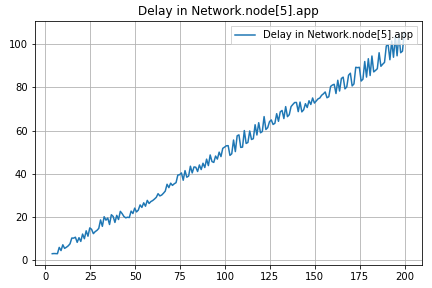

# Análisis y comparación de estrategias para el enrutamiento de una red con cierta topologia particular

## Resumen 
En este informe se va a analizar y comparar un algoritmo de enrutamiento para las redes de topologia tipo anillo, con la posibilidad de extender el algoritmo a topologías más generales.

El algoritmo que implementamos lo llamamos **"Falso Dijkstra"**. Te preguntarás por que el nombre y es porque internamente en cada nodo la topologia de la red se representa como un grafo donde todos caminos son de peso 1. En lugar de utilizar el algoritmo de Dijkstra para calcular las distancias mínimas entre dos nodos, se utiliza el algoritmo de BFS (Breadth-First Search). Los resultados obtenidos muestran un buen desempeño, aumentando la eficiencia de la red y la cantidad de paquetes entregados en comparación con el algoritmo inicial.

## Introducción

### Estrategias de enrutamiento

El enrutamiento en redes de computadoras es un problema que se presenta en la capa de red del modelo OSI o TCP/IP. El objetivo es encontrar la ruta más eficiente para enviar paquetes de datos desde el origen al destino. Esto es importante para optimizar el rendimiento de la red y minimizar la cantidad de paquetes demorados o perdidos. 

Existen diferentes estrategias para resolver este problema, cada una con sus propias ventajas y desventajas. En este informe, se analizará el rendimiento de un algoritmo de enrutamiento en particular, comparándolo con el algoritmo inicial dado por la catedra.

### Metodología de trabajo
Para analizar el comportamiento de la red con el algoritmo y sin el mismo, al igual que en el lab 3 utilizaremos **simulación discreta**.

En la **simulación discreta** es una técnica de simulación la cual en lugar de considerar el tiempo de manera continua, se divide en pasos o intervalos discretos. Cada uno de estos intervalos representa un punto en el tiempo en el que se realiza una actualización en el estado del sistema que se está simulando.

Esta técnica de modelado es especialmente útil cuando se trabaja con sistemas dinámicos complejos, ya que permite simular su comportamiento de manera más manejable y comprensible. Al dividir el tiempo en pasos discretos, se simplifica el proceso de cálculo y se facilita el seguimiento y análisis de los cambios en el estado del sistema en diferentes puntos en el tiempo.

Las simulaciones se llevan a cabo en una computadora utilizando **Omnet++**, un **entorno de simulación de eventos discretos**. En este entorno, se crea un modelo que representa una red simplificada y su comportamiento. El objetivo es analizar cómo funciona la red en diferentes escenarios, tanto con como sin la estrategia de enrutamiento implementada.

**Omnet++** es una herramienta poderosa que permite realizar estas simulaciones y analizar los resultados obtenidos. Proporciona un entorno flexible y configurable para modelar diferentes aspectos de la red y realizar experimentos virtuales. Esto ayuda a comprender cómo se comporta la red en diferentes situaciones y a evaluar la eficacia de los algoritmos en la optimización del rendimiento de la red.

La ventaja de utilizar simulación discreta es que se puede simular el comportamiento de la red en un tiempo _mucho menor_ al que se tardaría en realizar pruebas en una red real, y se puede analizar el comportamiento de la red en situaciones que serían _muy difíciles_ de simular en una red real. Por esa razón este estilo de simulación es una herramienta muy útil para analizar el comportamiento de una red.

### Análisis de los experimentos
Evaluaremos el funcionamiento de la estrategia de enrutamiento mediante dos casos de prueba.

- **Caso 1:** Se envian paquetes de manera regular desde dos nodos (El nodo 0 y el nodo 2) hacia un mismo nodo (El nodo 5).
- **Caso 2:** Se envian paquetes de manera regular desde todos los nodos (Excepto el nodo 5) hacia un mismo nodo (El nodo 5).

#### Estructura de la red

La red que se utiliza para realizar las simulaciones es una red de topología tipo anillo. 

En esta red internamente cada nodo cuenta con una capa de aplicación (app) que implementa un generador de tráfico y se encarga de generar y recibir los paquetes, una capa de red (net) que se encarga de el enrutamiento de los paquetes y dos capas de enlace (lnk) que se encargan de enviar los paquetes a los vecinos e implementa un buffer para almacenar los paquetes hasta poder ser enviados. Entonces cada nodo está conectado a dos vecinos, uno a la izquierda y otro a la derecha. Se puede ver la estructura de la red sintetizada en la siguiente imagen:

Cada paquete que la capa de red recibe es evaluado para determinar si el nodo local es el destino final del mismo. En caso de que lo sea, el paquete es enviado a la capa de aplicación local. En caso de que el paquete esté destinado a otro nodo se elige una interface para re-transmitirlo. 

En la implementación dada por la catedra la capa de red elige siempre mandar el paquete por la interfaz 0 (toLnk[0]) que es la que envía el tráfico en sentido de las manecillas del reloj a lo largo del anillo hasta llegar al destino. No se toman decisiones basadas en la eficiencia o la minimización de la ruta y se envian los paquetes de esa manera predeterminada, por lo que se puede esperar que el rendimiento de la red usando esa estrategia no sea óptimo.

El tamaño de los paquetes en todos los casos de prueba será de 125000 bytes, la tasa de transferencia de todos los enlaces es de 1Mbps, su retardo es de 0,1ms y el tiempo de simulación será de 200 segundos.

Se modificó la capa de app dada en el kickstarter para permitir la medición de estadisticas de la red, como paquetes enviados, paquetes recibidos, demora en la entrega de paquetes, cantidad de saltos, utilización de los buffers, etc. Luego de cada simulación se accede a estas estadisticas y se las utiliza para generar los gráficos y tablas que se presentan en este informe y permiten analizar el rendimiento de la red.

También se tuvo que modificar la estructura del paquete para integrar un campo con la cantidad de saltos que el paquete lleva realizados.

#### Caso 1

En el primer caso de prueba, hay dos nodos fuente, Nodo 0 y Nodo 2, y un nodo receptor, Nodo 5. Si nos fijamos en la estructura de la red, podemos notar que la mejor ruta que puede tomar el Nodo 0 es en sentido de las agujas del reloj, mientras que para el Nodo 2 es en sentido contrario a las agujas del reloj.

|Demora|Buffer|
|------|------|
|||

Como primer punto podemos observar que la demora en con esta estructura cada vez es mayor. Inicialmente, esto ocurre porque en la configuración proporcionada no se elige la ruta óptima para enviar los paquetes desde el Nodo 2 hasta el Nodo 5. Además, se produce un problema adicional en un tramo de la ruta, donde se envían paquetes tanto desde el Nodo 0 como desde el Nodo 2, lo que genera un mayor retraso debido a que se supera la capacidad de esos enlaces para manejar tantos paquetes.

Para los buffer, se puede ver que se genera un fenomeno por causa de esto. El nodo 0 genera paquetes que estan listos para ser enviado pero, tambien se usa la misma ruta para enviar nodos desde el nodo 2. A causa de lo anterior, el enlace que conecta el nodo 0 con el nodo 1 no maneje esta ola de paquetes proveniente del nodo 0, y esto provoca que se acumulen en el buffer del nodo 0 

[INSERTAR RESULTADOS Y ANALISIS, CHAMUYO O COMPARACION DE ESOS RESULTADOS]

#### Caso 2

[INSERTAR RESULTADOS Y ANALISIS, CHAMUYO O COMPARACION DE ESOS RESULTADOS]

#### Conclusiones

## Métodos

Para resolver el problema de enrutamiento proponemos un algoritmo que llamamos **"Falso Dijkstra"**, que funciona de la siguiente manera:

1. Al inicializar la red, cada nodo envia un paquete "Hello" a todas las interfaces que tiene disponibles. 
2. Cuando un nodo vecino recibe el paquete "Hello", le envia un paquete "HelloAck" al nodo que lo envio. El paquete "HelloAck" contiene el id del nodo que esta enviando el paquete.
3. Cuando un nodo recibe un paquete "HelloAck", guarda la información de que el nodo que envio el paquete es un vecino suyo.
4. Cuando un nodo recibe el nombre de todos sus vecinos, prepara un paquete especial llamado "Info" que contiene el id del nodo que lo envia y su lista de vecinos. Este paquete se envia a todos los nodos de la red mediante inundación.
5. Cuando un nodo recibió el paquete "Info" de todos los nodos de la red, calcula el camino mas corto hacia todos los nodos de la red utilizando el algoritmo BFS. 
6. Se rellena una tabla de enrutamiento con la información obtenida en el paso anterior.
7. Cuando un nodo recibe un paquete de datos, lo envia por la interfaz que corresponda según la tabla de enrutamiento.

Elegimos BFS frente a Dijkstra debido a que BFS permite computar distancias minimas en grafos no ponderados/con solo peso 1, y la topologia de la red se representa como un grafo donde todos caminos son de peso 1. Además la complejidad de Djkstra es O(n^2) y la de BFS es O(n+m) donde n es la cantidad de nodos y m la cantidad de aristas, dando que en grafos no densos (Como la topologia que presentan la mayoria de las redes) BFS es más eficiente. 

### Implementación

Para poder implementar el algoritmo propuesto se tuvo que modificar la capa de red (net) y la estructura del paquete.

En la estructura del paquete se agregó un campo que contiene una lista/vector de nodos. Este campo se utiliza para guardar la lista de vecinos de cada nodo en los paquetes de tipo "Info" que se envian durante el proceso de inicialización de la red.

En la capa de red hubo mushisimos cambios. Se agregaron los siguientes campos:
- `routingTable`: Una tabla/map de enrutamiento que contiene la información de que interfaz utilizar para llegar a cada nodo de la red.
- `graph`: Una estructura que representa el grafo de la red. Se utiliza para calcular el camino mas corto hacia todos los nodos de la red.
- `infoReceived`: Un map que se utiliza para saber cuando se recibió el paquete "Info" de todos los nodos de la red.
- `ready`: Un booleano que se utiliza para saber cuando el nodo esta listo para enviar paquetes de datos.
- `numInterfaces`: Un entero que se utiliza para saber cuantas interfaces (validas) tiene el nodo.
- `numNeighborsKnown`: Un entero que se utiliza para saber cuantos vecinos del nodo ya conocemos su id.
- `neighbors`: Un map que vincula el id de un nodo con su interfaz correspondiente. Se utiliza para saber que interfaz utilizar para enviar un paquete a un nodo vecino.

Se vincularon los siguientes "tipos" de paquetes al `Kind` del paquete:
- `Hello`: Kind 3
- `HelloAck`: Kind 4
- `Info`: Kind 5

El nuevo proceso de inicialización inicializa las variables necesarias y envia un paquete "Hello" por todas las interfaces validas.

Luego, las modificaciones en el metodo `handleMessage` son las siguientes:
- Si se recibe un paquete de tipo Hello se envia un paquete de tipo HelloAck por la interfaz correspondiente.
- Si se recibe un paquete de tipo HelloAck se guarda la información de que el nodo que envio el paquete es un vecino en el map `neighbors` y en el grafo, además de incrementar el contador `numNeighborsKnown` y establecer `infoReceived` en false para el nodo que envio el paquete.
  - Si `numNeighborsKnown` es igual a `numInterfaces` se envia un paquete "Info" con la lista de vecinos del nodo por todas las interfaces validas.
- Si se recibe un paquete de tipo Info y ya habiamos recibido un paquete de tipo Info del nodo que envio el paquete, es decir, su entrada en el map `infoReceived` es true, se ignora el paquete.
  - Si no se habia recibido un paquete de tipo Info del nodo que envio el paquete, se guarda la lista de vecinos del nodo en el grafo y se establece `infoReceived` en true para el nodo que envio el paquete y en false para todos los vecinos (del nodo que envio el paquete) que nosotros no conociamos hasta ahora. Luego se reenvia el paquete "Info" por todas las interfaces validas excepto la que recibimos el paquete (Para generar inundación).
  - Si luego de recibir un paquete de tipo Info se cumple que `infoReceived` es true para todos los nodos de la red, se calcula el camino mas corto hacia todos los nodos de la red utilizando BFS y se rellena la tabla de enrutamiento con la interfaz correspondiente para llegar a cada nodo.

Finalmente, si se recibe un paquete de tipo Data y `ready` es true, se envia el paquete por la interfaz correspondiente según la tabla de enrutamiento. Si `ready` es false, se ignora el paquete.

## Resultados

### Caso 1

[INSERTAR RESULTADOS Y ANALISIS, CHAMUYO O COMPARACION DE ESOS RESULTADOS]

### Caso 2

[INSERTAR RESULTADOS Y ANALISIS, CHAMUYO O COMPARACION DE ESOS RESULTADOS]

### Caso 3 - Netowrk Star (Punto estrella)

[INSERTAR RESULTADOS Y ANALISIS, CHAMUYO O COMPARACION DE ESOS RESULTADOS]

## Discusión

[Una sección con las limitaciones durante la ejecución del proyecto, problemas y posibles mejoras de los algoritmos propuestos. Ademas puede ir una mini colclusion de lo que se aprendio durante el proyecto]

## Referencias
- Contenido audiovisual (videos/filminas) provisto por la catedra
- [Manual de OMNeT++](https://doc.omnetpp.org/omnetpp/manual/)
- Redes de Computadoras - Libro de Andrew S. Tanenbaum (5ta edición)
