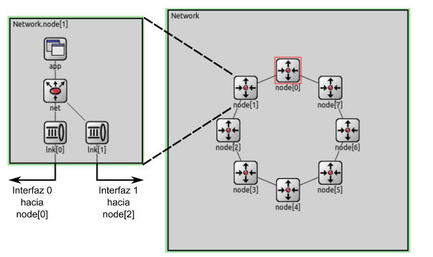

# Control y enrutamiento de una red

## Resumen 
En este informe se va a analizar y comparar un algoritmo para las redes de anillo.
El algoritmo que implementamos lo llamamos **"Falso Dijkstra"** y se preguntaran por que el nombre, bueno, es porque en realidad se representa un grafo donde todos caminos son de peso 1. En lugar de utilizar el algoritmo de Dijkstra para calcular las distancias mínimas entre dos nodos, se utiliza el algoritmo de BFS (Breadth-First Search) debido a las características particulares del grafo.

## Introducción
Se introdujo un red de forma de anillo donde cada nodo esta conectado a otros dos.
Cada nodo cuanta con una capa de aplicación y una capa de transporte estas capas trabajan juntas para procesar y dirigir los paquetes dentro del anillo.

La capa de aplicación se encarga de :
- Generar paquetes
- Enviar paquetes

Y la capa de transporte se encarga de:
- Mandar paquetes que viene de la  capa de aplicación
- Recibir paquetes de los vecinos y enviarlo al otro

